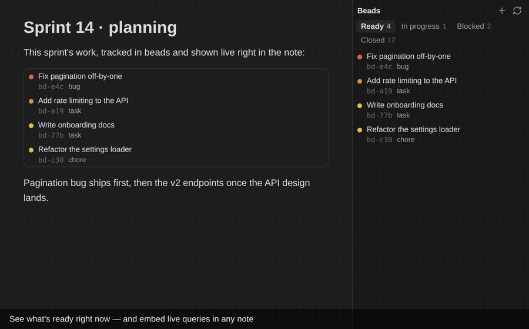

# Beads for Obsidian

A tiny, **desktop-only** Obsidian plugin that renders a **live, clickable pane** for the
[Beads (`bd`)](https://github.com/gastownhall/beads) issue tracker — and does *real*
integration: **close an issue straight from a checkbox.**

No Obsidian + Beads plugin existed before this one — it fills a genuine gap for anyone
who tracks work in `bd` and lives in Obsidian.

<!-- Demo GIF — record a short loop (open pane → tick a checkbox → issue closes) and
     drop it at assets/demo.gif. See docs/RELEASE.md. -->


## Features

- 🗂️ **Ready-first, tabbed pane** — a native `ItemView` with **Ready · In progress ·
  Blocked · Closed** tabs (each with a live count), so you open straight to *what you
  can do right now*. Only the active tab hits `bd`, and each paginates with **Load
  more**, so the pane opens fast even with thousands of closed issues. Blocked rows show
  a `⛓ n` hint.
- ✏️ **Edit on click** — click a row to open the detail modal (`bd show`) and change
  title, type, priority, status (close/reopen here), and description (`bd update`); it
  also shows **Blocked by** / **Blocks** dependency lists (click any to jump to it).
- ⚡ **Quick capture** — *Beads: Capture a bead* (or the `+` in the pane) opens a box:
  type a title and press Enter for the fast path, or set type / priority / description
  first (`bd create`).
- 📄 **Live `beads` code blocks** — embed a query in any note (Dataview-style) and get
  the same clickable rows inline. See [Embedding queries](#embedding-queries-in-notes).
- 🔢 **Status-bar count** — an ambient `● N ready` even when the pane is closed.
- 🔄 **Auto-refresh** — on a configurable interval *and* whenever the `.beads`
  directory changes on disk (so external `bd` edits show up).
- ⚙️ **Near-zero setup** — if your vault folder itself contains a `.beads/`, the
  project root auto-fills on first load.

## Requirements

- **Obsidian desktop** — the plugin shells out to a local binary via Node's
  `child_process`, which is unavailable on mobile. `isDesktopOnly` is set.
- **The `bd` CLI** — install [Beads](https://github.com/gastownhall/beads) and make
  sure `bd` is on your `PATH` (or set an explicit path in settings).

## Installation

### Community plugins (once accepted)

Settings → Community plugins → Browse → search **"Beads"** → Install → Enable.

### Manual

1. Download `main.js`, `manifest.json`, and `styles.css` from the latest
   [release](https://github.com/Rome-1/obsidian-beads/releases).
2. Copy them into `<your-vault>/.obsidian/plugins/beads-pane/`.
3. Reload Obsidian and enable **Beads** under Community plugins.

## Usage

1. Open **Settings → Beads** and set **Project root** to a directory that contains a
   `.beads/` database (auto-filled if your vault folder has one). Click **Test
   connection** to confirm `bd` is reachable.
2. Open the pane: click the **list-checks** ribbon icon, or run **"Beads: Open Beads
   pane"** from the command palette. Switch tabs (Ready / In progress / Blocked /
   Closed) and use **Load more** to page through long lists.
3. Click a row to open its detail modal, where you can edit any field — title, type,
   priority, **status** (set it to `closed` to close, or back to `open` to reopen) and
   description — and see its dependencies.
4. Capture new work anytime with **"Beads: Capture a bead"** (bind it to a hotkey) or
   the `+` in the pane header.

## Embedding queries in notes

Put a fenced `beads` code block in any note to render a live, clickable list right
where you're thinking. One directive per line:

````markdown
```beads
ready
```
````

````markdown
```beads
query: status=open AND priority<=1
limit: 10
```
````

Accepted directives:

| Directive | Meaning |
| --- | --- |
| `ready` | Unblocked, actionable issues (`bd ready`). |
| `blocked` | Issues waiting on dependencies (`bd blocked`). |
| `list` | All open issues (`bd list`). |
| `query: <expr>` | A [bd query](https://github.com/gastownhall/beads) expression, e.g. `status=open AND priority<=1`. |
| `limit: <n>` | Max rows (clamped to 50). |

Embeds re-run when the note renders (and after you close an issue from one) — never on
a timer — and share a global read cache, so many blocks won't hammer `bd`.

## Settings

| Setting | Default | Description |
| --- | --- | --- |
| Project root | *(empty)* | Absolute path to the directory containing `.beads/`. |
| `bd` binary path | `bd` | Path to the `bd` executable. If not found, use the full path from `which bd` (see Troubleshooting). |
| Auto-refresh interval | `30` | Seconds between refreshes (`0` disables). |

## Troubleshooting

- **"bd binary not found" / the pane is empty and *Test connection* fails.** GUI-launched
  apps often don't inherit your shell `PATH`, so the default `bd` can't be resolved. Run
  `which bd` in a terminal and paste the full path into **Settings → Beads → bd binary
  path**.
- **"No bd database here."** The project root must be a directory that contains a
  `.beads/` folder. Point it at your `bd` project (not necessarily your vault).
- **Nothing happens when I tick a blocked issue.** `bd` won't close an issue that still
  has open blockers; the error is shown as a notice. Close its blockers first (the detail
  modal lists them), or change its status from the detail modal.
- **The pane didn't update after a CLI change.** It refreshes on an interval and when
  `.beads/` changes on disk; hit the refresh icon to force it.

## Security

- The plugin runs the `bd` binary you configure, in the project root you configure —
  the same trust model as the [Shell commands
  plugin](https://github.com/Taitava/obsidian-shellcommands). Point it only at a `bd`
  you trust.
- Commands are invoked with `execFile` and an **argument array** — never a shell
  string — so issue IDs and other values can't inject shell metacharacters.
- Issue titles and descriptions render as plain text (never HTML), so a bead authored
  elsewhere and synced in can't inject markup into the pane. Data-controlled values are
  also passed after a `--` sentinel (or as `--flag=value`) so they can't be reparsed as
  `bd` flags.
- The plugin runs `bd` against whatever `.beads/` your project root points at (including
  an auto-detected vault-local one). It never executes anything *from* the dataset — but
  that means you trust `bd`'s own parsing of that database, as with any `bd` invocation.

## Development

```bash
npm install
npm run dev     # esbuild watch → main.js
npm run build   # typecheck + production bundle
```

To test against a real vault, symlink or copy `main.js`, `manifest.json`, and
`styles.css` into `<vault>/.obsidian/plugins/beads-pane/`.

## Prior art (inspiration)

- **[Taitava/obsidian-shellcommands](https://github.com/Taitava/obsidian-shellcommands)**
  — the canonical desktop-only `child_process` pattern.
- **Beads** — `bd --help`, `bd list --json`, `bd show --json`, `bd close`.
- High-star pane/view plugins (Kanban, Tasks, Dataview) for `ItemView` and
  workspace-leaf conventions.

## License

MIT © Rome-1
