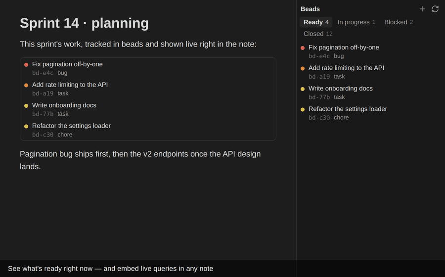

# Beads for Obsidian

A tiny, **desktop-only** Obsidian plugin that renders a **live, clickable pane** for the
[Beads (`bd`)](https://github.com/gastownhall/beads) issue tracker — and does *real*
integration: click any issue to **edit it in a tab**, as YAML frontmatter + a markdown
body, and save straight back to `bd`.

No Obsidian + Beads plugin existed before this one — it fills a genuine gap for anyone
who tracks work in `bd` and lives in Obsidian.



## Features

- 🗂️ **Ready-first, tabbed pane** — a native `ItemView` with **Ready · In progress ·
  Blocked · Closed** tabs (each with a live count), so you open straight to *what you
  can do right now*. Only the active tab hits `bd`, and each paginates with **Load
  more**, so the pane opens fast even with thousands of closed issues. Blocked rows show
  a `⛓ n` hint.
- ✏️ **Edit in a tab** — click a row and the bead opens like a note (not a popup): a
  title, a **Properties** panel of typed controls (status — set it to `closed` to close,
  or back to `open` to reopen — priority, type, assignee, labels) and a **markdown
  description**. Save (or ⌘/Ctrl-S) writes only the changed fields via `bd update`.
  **Blocked by** / **Blocks** and the **comment thread** (rendered markdown) show below.
- ⚡ **New bead** — *Beads: New bead* (or the `+` in the pane) opens the same editor,
  blank (`bd create`).
- 📄 **Live `beads` code blocks** — embed a query in any note (Dataview-style) and get
  the same clickable rows inline. See [Embedding queries](#embedding-queries-in-notes).
- 🔢 **Status-bar count** — an ambient `● N ready` even when the pane is closed.
- 🟢 **Live updates** — with Beads 1.3's events journal on, the pane follows `bd`'s own
  change feed and updates the moment a bead changes, from any terminal or agent. Without
  it, the pane refreshes on an interval and whenever `.beads/` changes on disk. See
  [Live updates](#live-updates).
- ⚙️ **Near-zero setup** — if your vault folder itself contains a `.beads/`, the
  project root auto-fills on first load.

## Requirements

- **Obsidian desktop** — the plugin shells out to a local binary via Node's
  `child_process`, which is unavailable on mobile. `isDesktopOnly` is set.
- **The `bd` CLI** — install [Beads](https://github.com/gastownhall/beads) and make
  sure `bd` is on your `PATH` (or set an explicit path in settings).

## Installation

### Community plugins (once accepted)

Settings → Community plugins → Browse → search **"Beads"** → Install → Enable.

### Manual

1. Download `main.js`, `manifest.json`, and `styles.css` from the latest
   [release](https://github.com/Rome-1/obsidian-beads/releases).
2. Copy them into `<your-vault>/.obsidian/plugins/beads-pane/`.
3. Reload Obsidian and enable **Beads** under Community plugins.

## Usage

1. Open **Settings → Beads** and set **Project root** to a directory that contains a
   `.beads/` database (auto-filled if your vault folder has one). Click **Test
   connection** to confirm `bd` is reachable.
2. Open the pane: click the **list-checks** ribbon icon, or run **"Beads: Open pane"**
   from the command palette. Switch tabs (Ready / In progress / Blocked /
   Closed) and use **Load more** to page through long lists.
3. Click a row to open the bead in an editor tab. Edit the title, the properties
   (**status** — set it to `closed` to close, or back to `open` to reopen — priority,
   type, assignee, labels) and the description, then **Save** (or ⌘/Ctrl-S).
   Dependencies and the comment thread show below.
4. Add new work anytime with **"Beads: New bead"** (bind it to a hotkey) or the `+` in
   the pane header.

## Embedding queries in notes

Put a fenced `beads` code block in any note to render a live, clickable list right
where you're thinking. One directive per line:

````markdown
```beads
ready
```
````

````markdown
```beads
query: status=open AND priority<=1
limit: 10
```
````

Accepted directives:

| Directive | Meaning |
| --- | --- |
| `ready` | Unblocked, actionable issues (`bd ready`). |
| `blocked` | Issues waiting on dependencies (`bd blocked`). |
| `list` | All open issues (`bd list`). |
| `query: <expr>` | A [bd query](https://github.com/gastownhall/beads) expression, e.g. `status=open AND priority<=1`. |
| `limit: <n>` | Max rows (clamped to 50). |

Embeds re-run when the note renders and when beads change (coalesced to at most twice a
second) — never on a timer — and share a global read cache, so many blocks won't hammer
`bd`.

## Live updates

[Beads 1.3.0](https://github.com/gastownhall/beads/releases/tag/v1.3.0) can keep an
ordered **events journal**: every change made through `bd` is recorded, with the bead's
full new state, in the same transaction as the change. When the journal is on, the
plugin runs one `bd events tail --follow` and applies each record to what is on screen:

- Edits to a bead you can see (title, priority, labels, status) are patched in place,
  with no `bd` call.
- A bead that stops belonging to a tab (closed, claimed, newly blocked) leaves it at once.
- Only when `bd` has to decide membership (is this bead now ready?) does the visible tab
  re-read, once per burst of changes. Tab counts re-read only when a status can have moved.
- An open bead editor reloads when its bead changes. If you have unsaved edits it keeps
  them and says the bead changed; **Revert** loads the new version.
- The small dot beside the pane title is filled green while live.

The journal is **off by default**, and turning it on is a workspace-wide choice: `bd
config set events-journal true` writes `.beads/config.yaml`, so every `bd` command in
that workspace, agents included, is journaled from then on (and every clone, if the file
is committed). So the plugin never turns it on by itself. With bd 1.3.0+ and the journal
off, the pane offers it once; **Turn on…** explains the effect and asks first. You can
also turn it on in **Settings → Beads → Live updates**, or from a terminal. Turn it off
with `bd config set events-journal false`; the plugin notices and goes back to polling.

Some changes never reach the journal: `bd dolt pull` and other syncs, `bd sql`, and a
switch to another clone (each clone numbers its own journal). While live, the plugin
checks the workspace's Dolt commit every **Auto-refresh interval** seconds (one cheap
`bd vc status`); if it moved with no journal record to explain it, the pane rebuilds from
current state. If the plugin falls behind the journal's retention window (7 days or
100,000 records by default, for example after the computer sleeps for a week), `bd`
reports the gap and the plugin rebuilds, then follows from the newest record.

The follow process is a long-lived `bd`: near-zero CPU, but it holds `bd`'s working set
(about 150 MB with an embedded store). With older `bd`, or the journal off, the plugin
behaves as before: it re-reads on an interval and when `.beads/` changes on disk.

The plugin does not use `bd serve`. It adds nothing over `bd events tail` for a single
local reader, it is still in preview, and today it refuses the default embedded store.

## Settings

| Setting | Default | Description |
| --- | --- | --- |
| Project root | *(empty)* | Absolute path to the directory containing `.beads/`. |
| `bd` binary path | `bd` | Path to the `bd` executable. If not found, use the full path from `which bd` (see Troubleshooting). |
| Auto-refresh interval | `30` | Seconds between refreshes (`0` disables). With live updates on, how often to check for changes the journal can't see, such as a sync. |
| Live updates | — | Shows whether the pane is following the events journal, and offers to turn it on. |

## Troubleshooting

- **"bd binary not found" / the pane is empty and *Test connection* fails.** GUI-launched
  apps often don't inherit your shell `PATH`, so the default `bd` can't be resolved. Run
  `which bd` in a terminal and paste the full path into **Settings → Beads → bd binary
  path**.
- **"No bd database here."** The project root must be a directory that contains a
  `.beads/` folder. Point it at your `bd` project (not necessarily your vault).
- **`bd` won't close a blocked issue.** It won't close an issue that still has open
  blockers; the error is shown as a notice. Close its blockers first (the editor tab
  lists them under **Blocked by** — click one to jump to it).
- **The pane didn't update after a CLI change.** Without live updates it refreshes on an
  interval and when `.beads/` changes on disk; hit the refresh icon to force it. Hover
  the dot beside the pane title to see which mode it is in and why. With bd 1.3.0+, turn
  on [live updates](#live-updates).
- **The status bar says "● bd error".** `bd` failed (not found, or the store is broken).
  Hover it for the message, and use **Test connection** in settings.

## Security

- The plugin runs the `bd` binary you configure, in the project root you configure —
  the same trust model as the [Shell commands
  plugin](https://github.com/Taitava/obsidian-shellcommands). Point it only at a `bd`
  you trust.
- Commands are invoked with `execFile` (or `spawn`, for the one long-lived
  `bd events tail`) and an **argument array** — never a shell string — so issue IDs and
  other values can't inject shell metacharacters.
- Issue titles and descriptions render as plain text (never HTML) in the pane, so a bead
  authored elsewhere and synced in can't inject markup. Comment threads in the editor
  render through Obsidian's own `MarkdownRenderer` — the same sanitized path as any note.
  Data-controlled values are also passed after a `--` sentinel (or as `--flag=value`) so
  they can't be reparsed as `bd` flags.
- The plugin runs `bd` against whatever `.beads/` your project root points at (including
  an auto-detected vault-local one). It never executes anything *from* the dataset — but
  that means you trust `bd`'s own parsing of that database, as with any `bd` invocation.

## Development

```bash
npm install
npm run dev     # esbuild watch → main.js
npm run build   # typecheck + production bundle
```

To test against a real vault, symlink or copy `main.js`, `manifest.json`, and
`styles.css` into `<vault>/.obsidian/plugins/beads-pane/`.

## Prior art (inspiration)

- **[Taitava/obsidian-shellcommands](https://github.com/Taitava/obsidian-shellcommands)**
  — the canonical desktop-only `child_process` pattern.
- **Beads** — `bd --help`, `bd list --json`, `bd show --json`, `bd close`.
- High-star pane/view plugins (Kanban, Tasks, Dataview) for `ItemView` and
  workspace-leaf conventions.

## License

MIT © Rome-1
